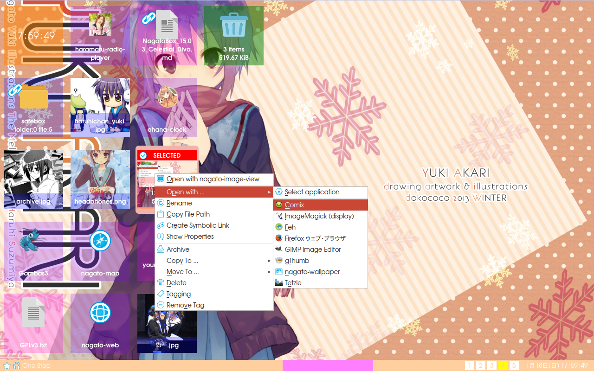

# NagatoBox

## What is this ?

a software suite for openbox3.



## Important Notice

Only watch this git from a distance in a well-lit room.

## Dependency

Gambas3 3.8 or later varsion

## Ubuntu and its variants

Use PPA instead of official repo.

```
    $ sudo add-apt-repository ppa:gambas-team/gambas3
    $ sudo apt-get update
    $ sudo apt-get install gambas3 
``` 

## License

all softwares in this repository are licensed under **S.O.S.Licese.**

```
    Save the world by overloading it with fun,
    Open source software
    Sharing
    License Agreement
    or : How I learned stop worrying and love Nagato Yuki
    (S.O.S. License)
    Version 8.8.8

    Copyright (c) takeda.nemuru 2012<takeda.nemuru@yandex.com>

    Everyone is permitted to copy or distribute this license document.

    TERMS AND CONDITIONS

    0. "You" in this license document shall mean any kind of organization, human, alien(including humanoid-interface also known as TFEI), time traveler and psychics.
    1. This software is free software and comes with ABSOLUTELY NO WARRANTY.
    2. You can do whatever you want with this software, as long as you love Nagato Yuki.
    3. If you think this software worth it, you can shout love for Nagato Yuki at the heart of the universe.
```

## Package List

### DataOverminds

Application			|Version	|Description
---			|----:	|----
dataovermind-rssfeeder		|0.1.1	|rss daemon
dataovermind-systemmonitor	|42.1.5	|system monitor daemon

### NagatoApplications

Application			|Version	|Description
---			|----:	|----
nagato-ambient		|42.1.0	|ambient sound player
nagato-archiver		|42.1.2	|patool frontend for file archiving
nagato-asx-player		|42.1.1	|asx file player
nagato-calculator		|x.x.x	|calculator
nagato-calendar		|x.x.x	|calendar
nagato-code-view		|42.1.3	|code viewer for Gambas3
nagato-color-picker		|x.x.x	|screen color picking tool
nagato-config-appearance	|0.1.2	|appearance config tool
nagato-config-screenlocker	|42.1.1	|frontend for i3 locker
nagato-dbus-finder		|x.x.x	|explorer for dbus
nagato-dictionary		|42.1.1	|English/Japanese dictionary
nagato-extractor		|42.1.2	|patool frontend for file extractoring
nagato-files			|42.1.5	|file manager and desktop shell
nagato-font-view		|x.x.x	|font viewer
nagato-gif-box*		|x.x.x	|gif animation viewer
nagato-image-view		|42.1.0	|image viewer
nagato-keycode-checker	|x.x.x	|keycode checker
nagato-lookup		|42.1.3	|application launcher/finder
nagato-map		|42.1.5	|map viewer
nagato-movie		|x.x.x	|movie file player
nagato-openbox-logout		|42.1.2	|logout dialog for openbox
nagato-pdf-view		|42.1.1	|pdf viewer
nagato-player-x		|42.1.0	|music player
nagato-screenshooter		|42.1.2	|standalone screenshot application
nagato-session		|42.1.2	|autostart manager
nagato-taskmanager		|42.1.2	|task manager
nagato-text			|x.x.x	|text editor
nagato-text-converter*		|x.x.x	|charactor code converter
nagato-wallpaper		|42.1.2	|wallpaper changer
nagato-weather		|42.1.7	|weather forecast
nagato-web		|42.1.2	|web browser
[nagato-writer](./readme_extra/nagato-writer)	|42.1.7	|markdown editor
yuki			|42.1.48	|interface for humanoid interface

### Misc Applications

Application			|Version	|Description
---			|----:	|----
haramaru-radio-player		|42.1.3	|haramaru-radio(an internet radio) player
nekomimi-clock		|x.x.x	|clock
ohana-clock		|x.x.x	|bonbori-matsuri has been waiting for you.
rotate-cube-demo		|x.x.x	|OpenGL demo
ssg-player			|42.1.3	|singer song gamer(an internet radio) player
xkcd-reader			|x.x.x	|xkcd(online comic) reader.

## To Do

[TODO](./readme_extra/NagatoBox_15.09_Summer_Camp_2015.md)
