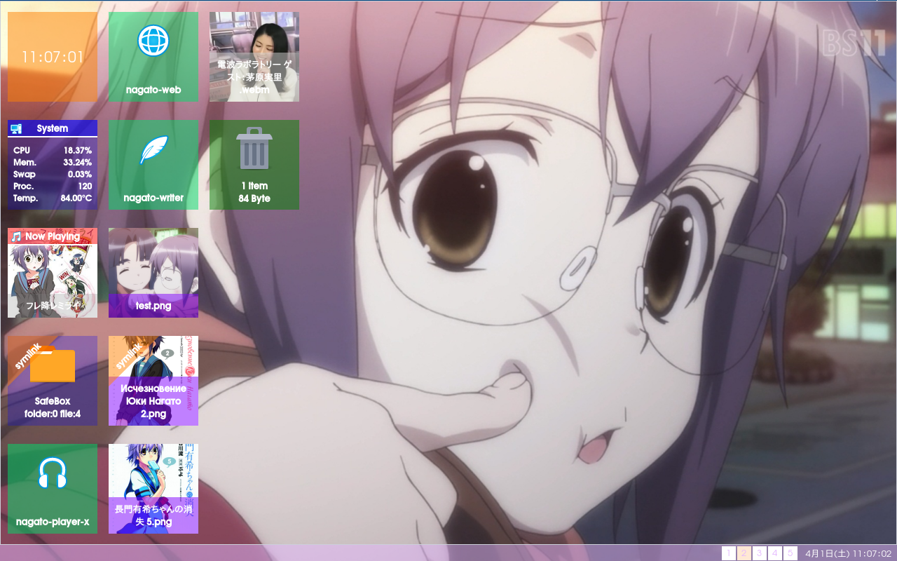

# NagatoBox

a software suite for Openbox3.



## Important Notice

Only watch this git from a distance in a well-lit room.

## Dependency

Gambas3 3.9 or later varsion

## Ubuntu and its variants

Use PPA instead of official repo.

```
    $ sudo add-apt-repository ppa:gambas-team/gambas3
    $ sudo apt-get update
    $ sudo apt-get install gambas3 
``` 

## License

all softwares in this repository are licensed under **S.O.S.Licese.**

```
    Save the world by overloading it with fun,
    Open source software
    Sharing
    License Agreement
    or : How I learned stop worrying and love Nagato Yuki
    (S.O.S. License)
    Version 8.8.8

    Copyright (c) takeda.nemuru 2012<takeda.nemuru@yandex.com>

    Everyone is permitted to copy or distribute this license document.

    TERMS AND CONDITIONS

    0. "You" in this license document shall mean any kind of organization, human, alien(including humanoid-interface also known as TFEI), time traveler and psychics.
    1. This software is free software and comes with ABSOLUTELY NO WARRANTY.
    2. You can do whatever you want with this software, as long as you love Nagato Yuki.
    3. If you think this software worth it, you can shout love for Nagato Yuki at the heart of the universe.
```

## To Do

[TODO](./readme_extra/todo/NagatoBox_42.10_Hare_Hare_Yukai.md)

## Applications

[Applications](./readme_extra/applications_list.md)

