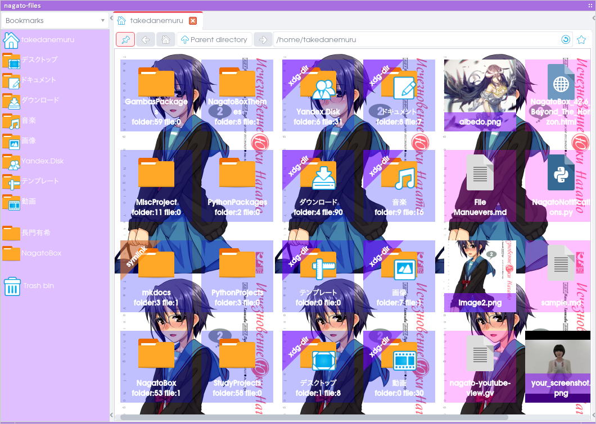
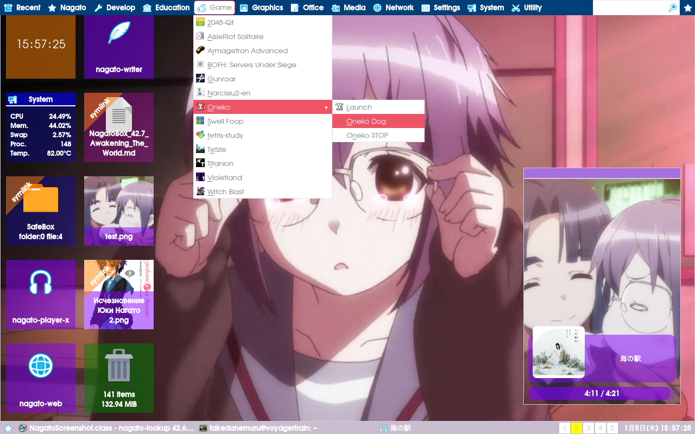
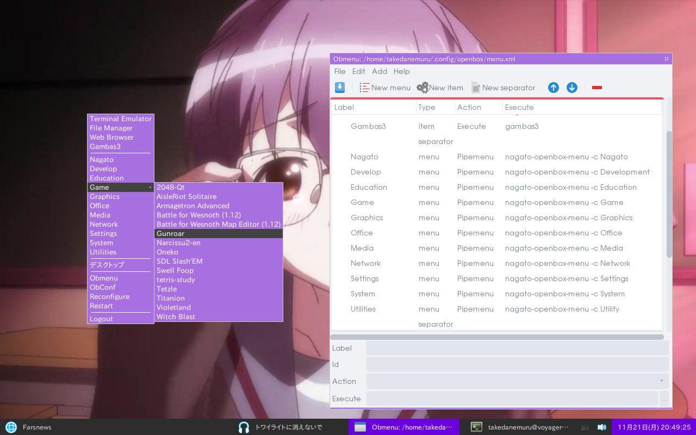
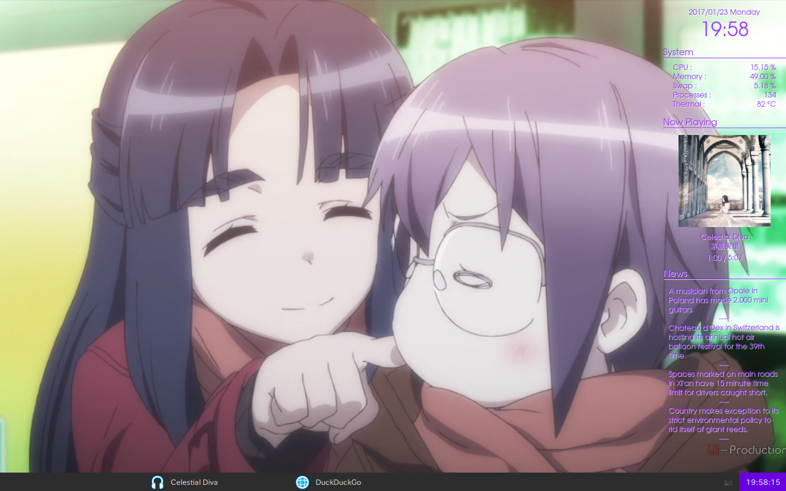
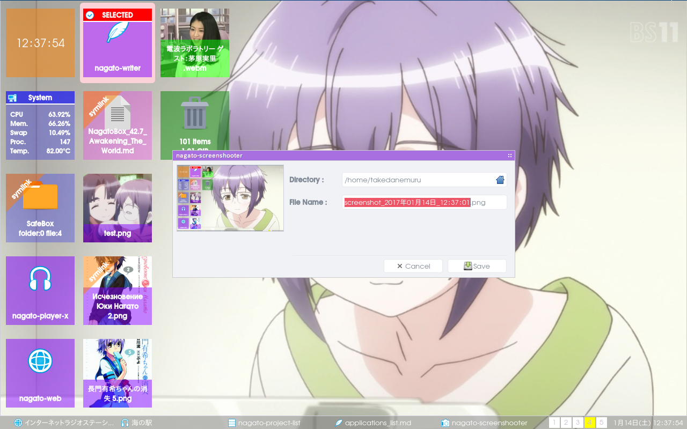
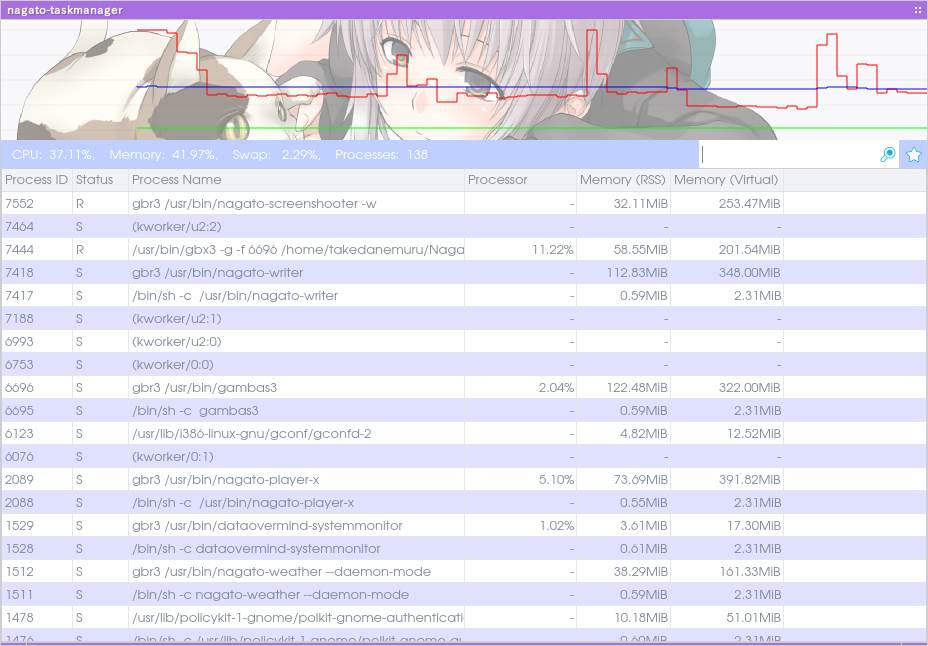
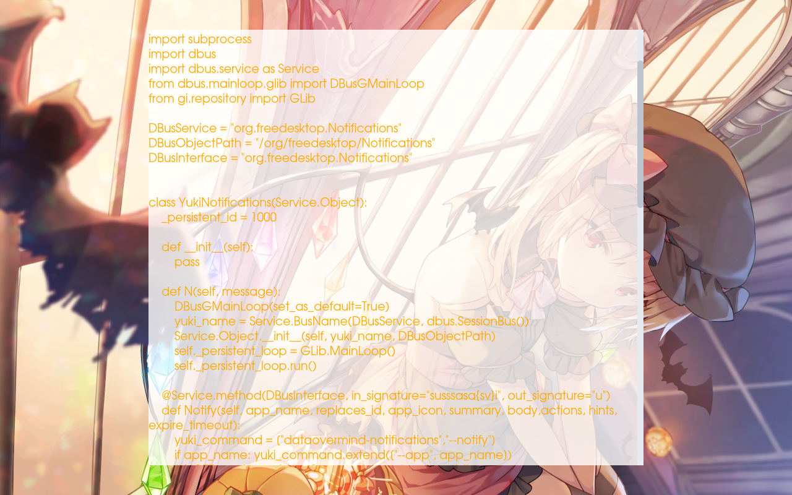
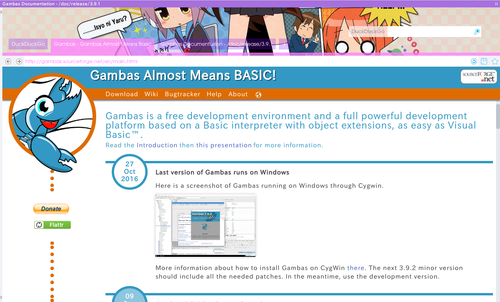

# Applications List

##  nagato-ambient (v42.8.7)

+ Description : play ambient sounds
+ Last Modefied : 2017-04-03

##  nagato-archiver (v42.8.8)

+ Description : an archiver.
+ Last Modefied : 2017-04-03

### archive types nagato-archiver can create

.tar, .zip, .bz2, .gz, .rar, .lzh, .xz, .tar.gz, .tar.xz, and .tar.bz2 

##  nagato-asx-player (v42.8.6)

+ Description : asx file player
+ Last Modefied : 2017-04-03

##  nagato-audio-editor (v42.7.6)

+ Description : audio file editor
+ Last Modefied : 2017-01-17

#### Dependency

+ sox

#### Functionalities

+ loudness
+ cut silence
+ bass boost

#### Cache Directory

CoverArt : `$XDG_CACHE_HOME/nagato-audio-editor`

##  nagato-battery-applet (v42.8.3)

+ Description : battery status icon for systray
+ Last Modefied : 2017-04-04

##  nagato-calculator (v42.8.9)

+ Description : calc it !
+ Last Modefied : 2017-04-04

##  nagato-calendar (v42.8.5)

+ Description : a calendar software.
+ Last Modefied : 2017-04-04

##  nagato-chart (v0.6.2)

+ Description : csv editor.
+ Last Modefied : 2016-11-17

##  nagato-code-view (v42.8.19)

+ Description : count lines of Gambas3 source codes.
+ Last Modefied : 2017-04-04

##  nagato-color-picker (v42.8.4)

+ Description : pick color number from anywhere.
+ Last Modefied : 2017-04-03

##  nagato-commander (v42.8.7)

+ Description : a terminal emulator
+ Last Modefied : 2017-04-03

##  nagato-config-appearance (v42.5.7)

+ Description : appearance configuration tool for NagatoBox
+ Last Modefied : 2016-09-30

##  nagato-config-shortcutkey (v0.6.2)

+ Description : global shortcut config tool for NagatoBox.
+ Last Modefied : 2016-11-08

##  nagato-dbus-finder (v42.8.7)

+ Description : dbus explorer
+ Last Modefied : 2017-04-03

##  nagato-diagram (v42.8.19)

+ Description : gui front-end for graphviz.
+ Last Modefied : 2017-04-04

graphical front end for graphviz.

ease to edit .gv files with preview. and export it as an image file.

##  nagato-dictionary (v42.8.10)

+ Description : English/Japanese dictionary
+ Last Modefied : 2017-04-04

##  nagato-extractor (v42.8.4)

+ Description : an archived file extracting tool for NagatoBox.
+ Last Modefied : 2017-04-03

##  nagato-files (v42.8.139)

+ Description : a file manager for NagatoBox
+ Last Modefied : 2017-04-01

### Database

Symbols : `~/.local/share/NagatoBox/database/Symbol`
Thumbnails : `~/.local/share/NagatoBox/database/Thumbnail`

##  nagato-font-view (v42.8.5)

+ Description : view fonts.
+ Last Modefied : 2017-04-03

##  nagato-gif-box (v42.8.6)

+ Description : a simple movie box for gif animation
+ Last Modefied : 2017-04-03

##  nagato-image-view (v42.6.5)

+ Description : a simple image viewer.
+ Last Modefied : 2016-11-13

##  nagato-keycode-checker (v42.8.2)

+ Description : check keycode.
+ Last Modefied : 2017-04-03

##  nagato-lookup (v42.8.42)

+ Description : a simple application launcher.
+ Last Modefied : 2017-04-04

##  nagato-map (v42.7.15)

+ Description : map viewer.
+ Last Modefied : 2017-01-18

##  nagato-mixer-applet (v42.8.11)

+ Description : simple mixer applet for trayicon
+ Last Modefied : 2017-04-04

##  nagato-movie (v42.8.8)

+ Description : movie player
+ Last Modefied : 2017-04-03

a simple movie player. no more, no less.

##  nagato-notifications (v42.6.33)

+ Description : notification daemon
+ Last Modefied : 2017-01-18

##  nagato-openbox-logout (v42.8.5)

+ Description : logout dialog for Openbox3
+ Last Modefied : 2017-04-04

##  nagato-openbox-menu (v42.8.28)

+ Description : A menu generator for Openbox3
+ Last Modefied : 2017-04-04

##  nagato-osd (v42.8.18)

+ Description : on screen display for openbox3
+ Last Modefied : 2017-04-04

### Note

now under heavy construction.

##  nagato-pdf-view (v42.8.6)

+ Description : pdf viewer
+ Last Modefied : 2017-04-04

##  nagato-player-x (v42.7.82)

+ Description : a music player with gstreamer backend.
+ Last Modefied : 2017-03-27

### Cache Directory

CoverArtFile : `$XDG_CACHE_HOME/nagato-player-x`

### Database

Host : `$XDG_DATA_HOME/NagatoBox/database/Media`

#### Tables

##### NagatoTableLibrary

Column		|DataType	|Note
----		|----		|----
id		|integer		|PrimaryKey
title		|string		|-
artist		|string		|-
album		|string		|-
path		|string		|full path of each music file
duration		|float		|in seconds

##### NagatoTablePlaylistNames

Column		|DataType	|Note
----		|----		|----
id		|integer		|PrimaryKey
playlist_name	|string		|-
playlist_description	|string		|-

##### NagatoTablePlaylistData

Column		|DataType	|Note
----		|----		|----
id		|integer		|PrimaryKey
playlist_name_id	|integer		|( TablePlaylistNames.id )
path		|string		|fullpath of each music file

##  nagato-project-list (v42.8.10)

+ Description : project listing tool for Gambas3
+ Last Modefied : 2017-04-04

### functionalities

+ list projects up on gridview.
+ generate markdown document(s) for local and github.
+ show project status by grid color.

### parsing destinations

+ `/PROJECT/doc/screenshots/*.png` for screenshot
+ `/PROJECT/doc/document.md` for document

##  nagato-rss-daemon (v42.7.15)

+ Description : rss feeder daemon
+ Last Modefied : 2017-02-20

##  nagato-ruler (v42.8.4)

+ Description : desktop ruler
+ Last Modefied : 2017-04-04

##  nagato-screenlocker (v42.7.8)

+ Description : a screen saver for NagatoBox
+ Last Modefied : 2017-01-24

##  nagato-screenshooter (v42.8.8)

+ Description : simple screenshooter
+ Last Modefied : 2017-04-04

##  nagato-session (v42.7.33)

+ Description : manage autostart
+ Last Modefied : 2017-01-14

##  nagato-stock-icon-list (v42.8.4)

+ Description : nagato shows you all stock icons for gambas3
+ Last Modefied : 2017-04-03

show all of gambas3 and NagatoBox stock icons.

##  nagato-systemmonitor-daemon (v42.8.25)

+ Description : system monitoring daemon
+ Last Modefied : 2017-04-04

##  nagato-taskmanager (v42.8.21)

+ Description : a task manager for NagatoBox
+ Last Modefied : 2017-04-04

taskmanager for NagatoBox

##  nagato-text-one (v42.8.17)

+ Description : a dead copy of FocusWriter :)
+ Last Modefied : 2017-04-04

##  nagato-wallpaper (v42.8.17)

+ Description : a wallpaper setter for *box window managers.
+ Last Modefied : 2017-04-04

##  nagato-wareki (v42.8.2)

+ Description : Japanese Era List
+ Last Modefied : 2017-04-03

##  nagato-weather (v42.8.23)

+ Description : stand alone weather application for NagatoBox
+ Last Modefied : 2017-04-03

##  nagato-web (v42.8.56)

+ Description : a web browser powered by Gambas3
+ Last Modefied : 2017-04-04

##  nagato-writer (v42.8.46)

+ Description : a markdown editor
+ Last Modefied : 2017-04-04

##  nagato-youtube-view (v42.8.14)

+ Description : youtube viewer
+ Last Modefied : 2017-04-04

##  yuki (v42.8.51)

+ Description : command line interface for humanoid interface.
+ Last Modefied : 2017-04-04

