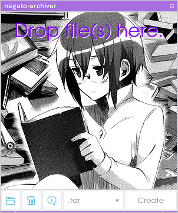
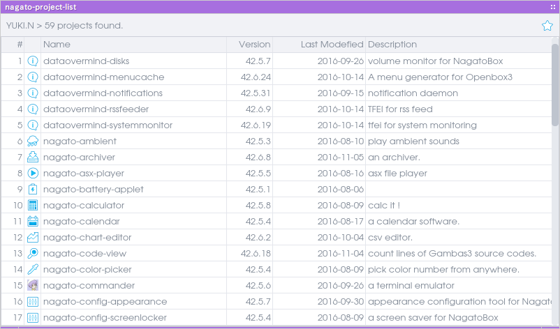

# Applications List

##  dataovermind-disks (v42.5.7)

+ Description : volume monitor for NagatoBox
+ Last Modefied : 2016-09-26

##  dataovermind-menucache (v42.6.24)

+ Description : A menu generator for Openbox3
+ Last Modefied : 2016-10-14

##  dataovermind-notifications (v42.5.31)

+ Description : notification daemon
+ Last Modefied : 2016-09-15

##  dataovermind-rssfeeder (v42.6.9)

+ Description : TFEI for rss feed
+ Last Modefied : 2016-10-14

##  dataovermind-systemmonitor (v42.6.19)

+ Description : tfei for system monitoring
+ Last Modefied : 2016-10-14

##  nagato-ambient (v42.5.3)

+ Description : play ambient sounds
+ Last Modefied : 2016-08-10

##  nagato-archiver (v42.6.8)

+ Description : an archiver.
+ Last Modefied : 2016-11-05

##  nagato-asx-player (v42.5.5)

+ Description : asx file player
+ Last Modefied : 2016-08-16

##  nagato-battery-applet (v42.5.1)

+ Description : 
+ Last Modefied : 2016-08-06

##  nagato-calculator (v42.5.8)

+ Description : calc it !
+ Last Modefied : 2016-08-09

##  nagato-calendar (v42.5.4)

+ Description : a calendar software.
+ Last Modefied : 2016-08-17

##  nagato-chart-editor (v42.6.2)

+ Description : csv editor.
+ Last Modefied : 2016-10-04

##  nagato-code-view (v42.6.18)

+ Description : count lines of Gambas3 source codes.
+ Last Modefied : 2016-11-04

##  nagato-color-picker (v42.5.4)

+ Description : pick color number from anywhere.
+ Last Modefied : 2016-08-09

##  nagato-commander (v42.5.6)

+ Description : a terminal emulator
+ Last Modefied : 2016-09-26

##  nagato-config-appearance (v42.5.7)

+ Description : appearance configuration tool for NagatoBox
+ Last Modefied : 2016-09-30

##  nagato-config-screenlocker (v42.5.4)

+ Description : a screen saver for NagatoBox
+ Last Modefied : 2016-08-09

##  nagato-config-shortcutkey (v0.0.1)

+ Description : 
+ Last Modefied : 2016-08-06

##  nagato-dbus-finder (v42.5.7)

+ Description : dbus explorer
+ Last Modefied : 2016-08-08

##  nagato-diagram (v42.6.17)

+ Description : gui front-end for graphviz.
+ Last Modefied : 2016-10-28

##  nagato-dictionary (v42.5.10)

+ Description : English/Japanese dictionary
+ Last Modefied : 2016-08-15

##  nagato-extractor (v42.6.4)

+ Description : an archived file extracting tool for NagatoBox.
+ Last Modefied : 2016-10-19

##  nagato-files (v42.6.117)

+ Description : a file manager for NagatoBox
+ Last Modefied : 2016-11-04

##  nagato-files-lite (v42.6.3)

+ Description : a light-weight filer
+ Last Modefied : 2016-10-04

##  nagato-font-view (v42.5.4)

+ Description : view fonts.
+ Last Modefied : 2016-08-16

##  nagato-fullscreen-editor (v42.5.10)

+ Description : a dead copy of FocusWriter :)
+ Last Modefied : 2016-08-17

##  nagato-gif-box (v42.5.5)

+ Description : a simple movie box for gif animation
+ Last Modefied : 2016-08-16

##  nagato-image-view (v42.5.3)

+ Description : a simple image viewer.
+ Last Modefied : 2016-08-26

##  nagato-keycode-checker (v42.5.2)

+ Description : check keycode.
+ Last Modefied : 2016-08-10

##  nagato-lookup (v42.6.40)

+ Description : a simple application launcher.
+ Last Modefied : 2016-10-21

##  nagato-map (v42.6.14)

+ Description : map viewer.
+ Last Modefied : 2016-10-24

##  nagato-mixer-applet (v42.5.9)

+ Description : simple mixer applet for trayicon
+ Last Modefied : 2016-08-11

##  nagato-movie (v42.6.6)

+ Description : movie player
+ Last Modefied : 2016-10-04

##  nagato-openbox-logout (v42.5.4)

+ Description : logout dialog for Openbox3
+ Last Modefied : 2016-08-09

##  nagato-pdf-view (v42.5.4)

+ Description : pdf viewer
+ Last Modefied : 2016-08-10

##  nagato-player-x (v42.6.72)

+ Description : a music player with gstreamer backend.
+ Last Modefied : 2016-10-16

##  nagato-project-list (v42.6.2)

+ Description : project listing tool for Gambas3
+ Last Modefied : 2016-10-04

### functionalities

+ list projects up on gridview.
+ generate markdown document(s) for local and github.

##  nagato-screenshooter (v42.5.4)

+ Description : simple screenshooter
+ Last Modefied : 2016-08-09

##  nagato-session (v42.6.32)

+ Description : manage autostart
+ Last Modefied : 2016-10-14

##  nagato-stock-icon-list (v42.5.3)

+ Description : nagato shows you all stock icons for gambas3
+ Last Modefied : 2016-08-16

##  nagato-taskmanager (v42.5.14)

+ Description : a task manager for NagatoBox
+ Last Modefied : 2016-08-30

##  nagato-text (v42.5.5)

+ Description : a simple text editor
+ Last Modefied : 2016-08-15

##  nagato-text-converter (v42.5.2)

+ Description : charactor code conversion tool
+ Last Modefied : 2016-08-09

##  nagato-wallpaper (v42.6.16)

+ Description : a wallpaper setter for *box window managers.
+ Last Modefied : 2016-10-11

##  nagato-wareki (v42.5.2)

+ Description : Japanese Era List
+ Last Modefied : 2016-08-16

##  nagato-weather (v42.6.23)

+ Description : stand alone weather application for NagatoBox
+ Last Modefied : 2016-10-14

##  nagato-web (v42.6.48)

+ Description : a web browser powered by Gambas3
+ Last Modefied : 2016-11-03

##  nagato-writer (v42.5.44)

+ Description : a markdown editor
+ Last Modefied : 2016-09-08

##  nagato-youtube-view (v42.5.9)

+ Description : youtube viewer
+ Last Modefied : 2016-09-29

##  yuki (v42.5.50)

+ Description : command line interface for humanoid interface.
+ Last Modefied : 2016-08-10

