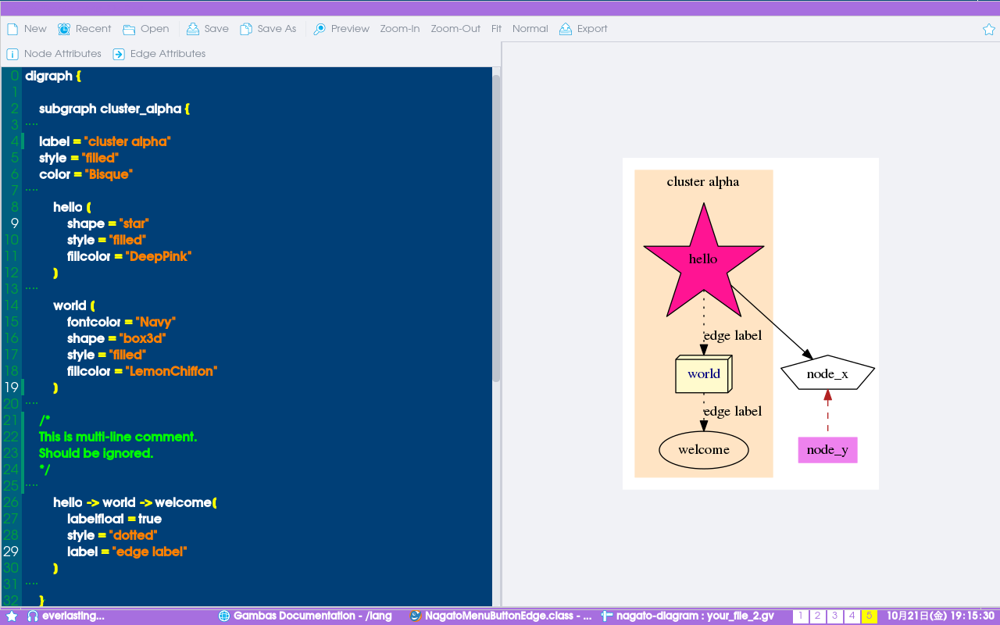
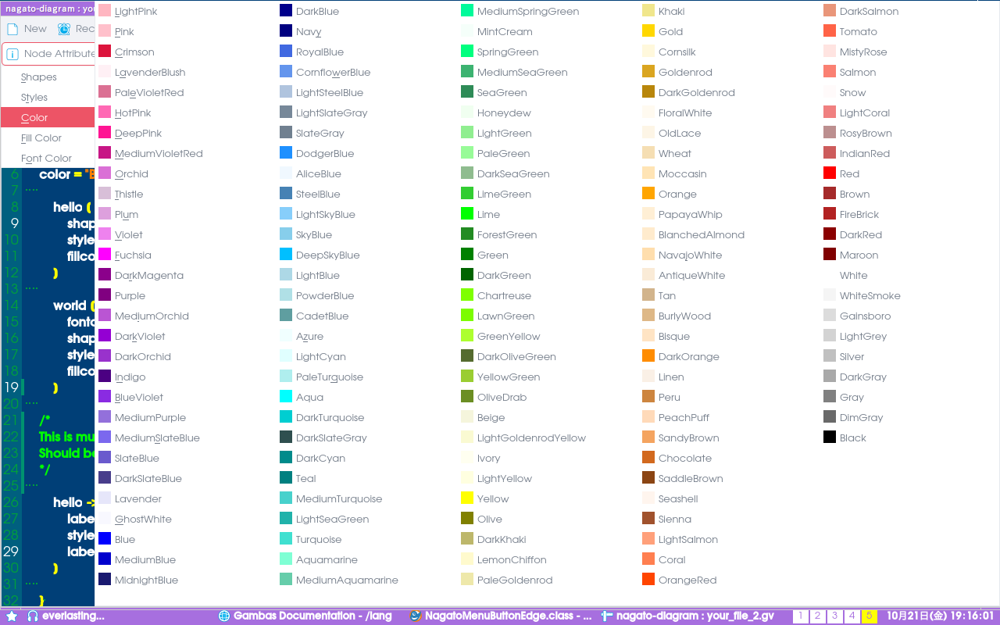
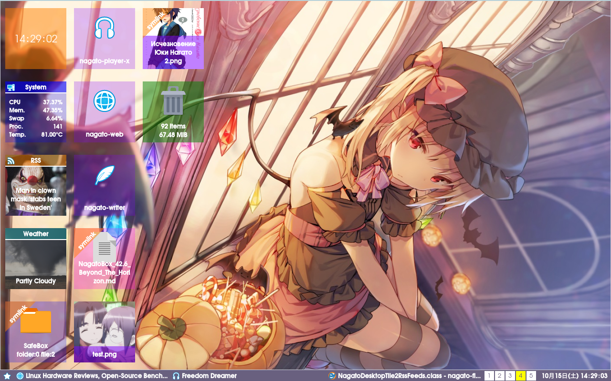
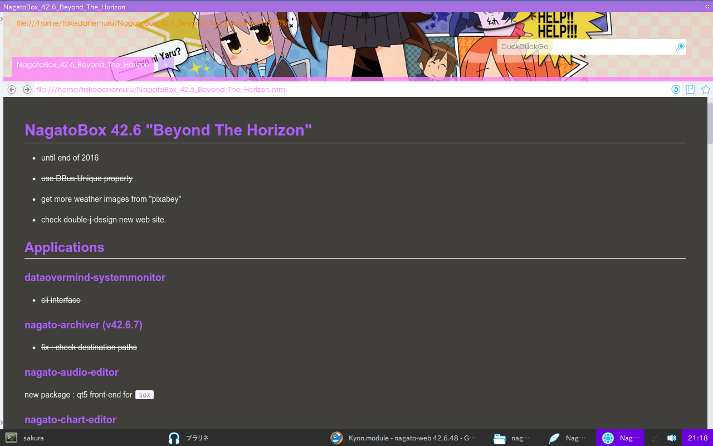

# NagatoBox 42.6 "Beyond The Horizon"

+ until end of 2016
+ ~~use DBus.Unique property~~
+ get more weather images from "pixabey"
+ check double-j-design new web site.

## Applications

### dataovermind-systemmonitor

+ ~~cli interface~~

### nagato-archiver (v42.6.7)

+ ~~fix : check destination paths~~

### nagato-audio-editor

new package : qt5 front-end for `sox`

### nagato-chart-editor

+ new :  finish all essential functionalities.

### nagato-code-view (v.42.6.17)

+ ~~fix : project icon data is read from .project. does not depend on icon file itself.~~

### nagato-diagram (42.6.15)

+ ~~add essential attributes insertation menu.~~

+ **must to restructure menu positions...**

+ **color chips on menus !!**

### nagato-extractor (v42.6.4)

+ ~~fix  : check path violation.~~

### nagato-files (v42.6.104)

+ ~~new : redesign symlink tag~~
+ ~~new : show xdg-user-dirs tag~~
+ ~~fix : avoid crash when rename fie/directory twice.~~
+ ~~fix : now can show symbol on symlink tile.~~
+ ~~fix : count selection on trash bin iconview correctlly.~~
+ ~~new : show "templates not found" on context menu for "create from template", when there are no files in xdg template dir.~~

### nagato-desktop (nagato-files -d)

+ ~~fix : avoid error on clock tile when new tiles are added.~~
+ ~~refine rss tile. use standard label and limit over height text.~~
+ ~~refine symlink tag.~~

#### happy halloween !!

### nagato-image-view

+ fix : resizing linkage.
+ simplify saving sequence.

### nagato-lookup (v42.6.38)

+ ~~new : clean thin mode view.~~
+ ~~revive : font color preference.~~

### nagato-movie (v42.6.6)

+ ~~fix under panel~~
+ ~~drop qt4 dependencies completely~~
+ ~~new : screenshot functionality~~
+ new : add preview into screenshot saving dialog

### nagato-player-x

+ ~~record last used directory for Choose Dialogs~~
+ ~~fix : avoid crash when move index to unexisted path.~~

### nagato-taskmanager

+ new : show net load.

### nagato-web

+ check _loaded sequence
+ ~~fix : now can open local html file again.~~

