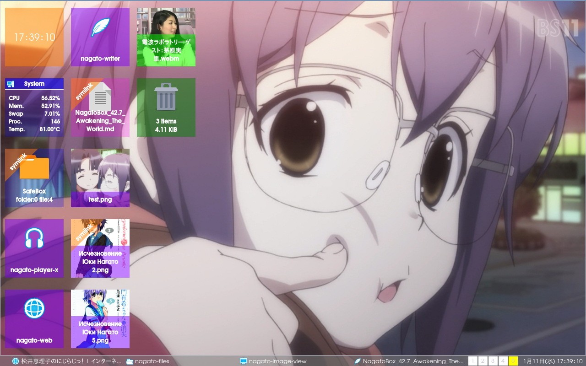

# NagatoBox 42.7 "Awakening The World"

+ until end of march 2017
+ add more doc files and screenshots
+ remove all the "working-directories"

## Applications

### nagato-ambient

+ ~~move sound files to `/usr/share/sounds/nagato-ambient` from `~/.nagato-ambient`~~

### nagato-audio-editor

+ ~~new : loudness~~
+ ~~new : cut silence from begining and ending~~
+ ~~new : bass boost~~
+ ~~new : about dialog~~
+ ~~mod : move cache directory to `$XGD_CACHE_HOME/nagato-audio-editor`~~

### nagato-files

+ tile color settings
+ ~~fix : remove working directories, use Desktop.CacheDir instead.~~
+ ~~mod : move DB to `$XDG_DATA_HOME/NagatoBox/database/foobar`~~

+ ~~desktop panel transparency~~ (experimental)

+ prohibit to launch app itself as super user (check policy per action.)

### nagato-pdf-view

+ text extraction

### nagato-player-x

+ fix form papercuts
+ ~~fix : remove working-directory~~
+ ~~mod : move DB to `$XDG_DATA_HOME/NagatoBox/database/media`~~
+ ~~cover art maximum size up to 300x300~~

### nagato-taskmanager

+ ~~network tab~~
+ rename to nagato-system-monitor (?)

### nagato-web

+ mod : move db host to `$XDG_DATA_DIR/NagatoBox/database`

### nagato-youtube-view

+ ~~mod : move db host to `$XDG_DATA_DIR/NagatoBox/database`~~

