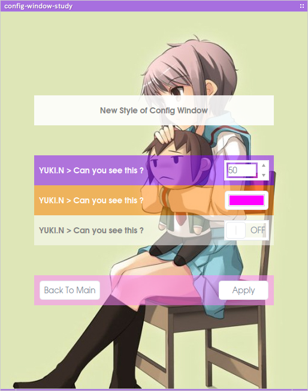

# NagatoBox 42.8 Ultimate Eyes

until end of june (Planning and preparing until 15th March)
check fixed windows

## Studies

+ Polkit Authority scripts (pygi) 
+ webdav/remoevable media mounting integration.
+ New Desgn for Config Dialog

## Applications

### nagato-color-picker

+ add star button
+ about dialog

### nagato-files

+ show tag symbol in treeview
+ fix : lost iconview background when all filetered icons are removed.

### nagato-files (nagato-desktop)

+ RssFeeder Tile : does not get thumbnail ?
+ Weather Tile : back to icon, drop thumbnail.
+ Music Tile : call nagato-player-x controls from tile context menu

### nagato-gif-box

+ new : about dialog

### nagato-notifications

+ icon capabilities.

### nagato-osd 

+ settings for SystemMonitor
+ settings for RSS feeder

## Deprecate

### ssg-player

+ service has been dead completely.
