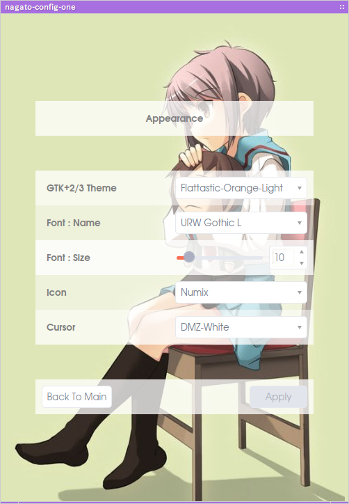

# NagatoBox 42.8 Ultimate Eyes

until end of june (Planning and preparing until 15th March)

check fixed windows

## Studies

+ Polkit Authority scripts (pygi) 
+ webdav/removable media mounting integration.
+ ~~New Design for Config Dialog~~

## Urgent

+ ~~nagato-desktop : solve panel refresh conflict.~~
+ ~~nagato-map : check web api for weather forecast. now can get per hour weather forecast~~ (update api to 1.9)
+ ~~nagato-player-x : fix album art mode window size.~~

## Applications

### nagato-battery-applet

+ add menus for quit, about and configs.

### nagato-color-picker

+ add star button
+ about dialog

### nagato-config-one

+ new app
+ access to another app config file through Settings.Path. do not integrated into dbus process like dconf or xfconfd.
+ check app instalation with conf file itself. do not check .desktop or any other files.

+ ~~new : xdg-usr-dirs configs~~

### nagato-files

+ show tag symbol in treeview
+ fix : lost iconview background when all filetered icons are removed.
+ ~~use File.FormatSize() instead of proper function.~~

### nagato-files (nagato-desktop)

+ RssFeeder Tile : does not get thumbnail ?
+ Weather Tile : back to icon, drop thumbnail.
+ Music Tile : call nagato-player-x controls from tile context menu

### nagato-gif-box

+ new : about dialog

### nagato-map

+ ~~version bump hault~~
+ ~~IMPORTANT : check weather forecast API. Now can show per hour forecast.~~

### nagato-notifications

+ icon capabilities.

### nagato-openbox-menu

+ ~~file directory menu~~ mostly done

### nagato-osd 

+ settings for SystemMonitor
+ settings for RSS feeder

### nagato-taskmanager

+ more love for network functionalities.

### nagato-trashbin-applet

+ new systray applet to handle trashes

### ohana-clock

+ ~~check this years bonbori-matsuri date (correct)~~

## Merge

+ ~~merge nagato-text, nagato-text-editor and nagato-text converter into nagato-text-one~~

## Deprecate

### ssg-player

+ service has been dead completely.
