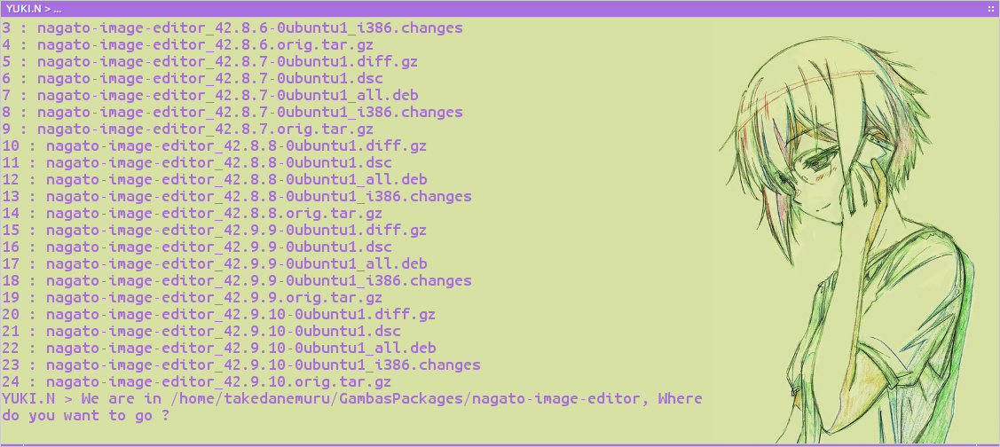

# NagatoBox_42.9_Borderless_Journey

Until End of September 2017

Fuckin hot, maybe dull quors.

## Project Wide Objectives

+ check copyright docs

## Applications

### nagato-asx-player

+ new : (context) menu for "start from beginning"
+ new : form context menu.

### nagato-files

+ ~~rev : remove xdg-user-dirs config dialog~~
+ rev : revamp weather tile display.

### nagato-image-editor

+ ~~fix : bugs on trimming functionality~~

### nagato-notifications

+ new : notifications log
+ new : per app rejection

### nagato-openbox-shortcutkeys

+ new : key binding editing.

### nagato-project-list

+ new : sort list by date (last modefied) 

### nagato-taskmanager

+ new : wifi tab (for access points)
+ new : separate star menu for wifi tab

### nagato-terminal (python application)

+ New App, a simple terminal emulator coded by python3+gobject

### nagato-web

+ ~~rev : call closure dialog from `Form_Close` event~~

### nagato-youtube-browser

+ ~~rename to nagato-youtube-browser~~

